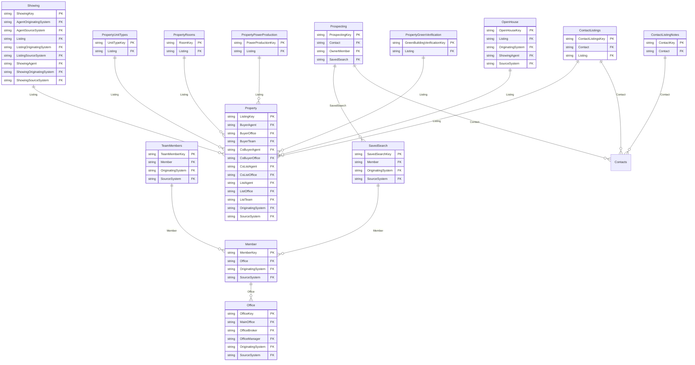

# RESO Simple ERD (No Orphans)

Mermaid ERD with only primary keys and foreign keys, excluding orphaned entities.

```mermaid
erDiagram
    Office {
        string OfficeKey PK
        string MainOffice FK
        string OfficeBroker FK
        string OfficeManager FK
        string OriginatingSystem FK
        string SourceSystem FK
    }

    TeamMembers {
        string TeamMemberKey PK
        string Member FK
        string OriginatingSystem FK
        string SourceSystem FK
    }

    Prospecting {
        string ProspectingKey PK
        string Contact FK
        string OwnerMember FK
        string SavedSearch FK
    }

    SavedSearch {
        string SavedSearchKey PK
        string Member FK
        string OriginatingSystem FK
        string SourceSystem FK
    }

    Member {
        string MemberKey PK
        string Office FK
        string OriginatingSystem FK
        string SourceSystem FK
    }

    PropertyGreenVerification {
        string GreenBuildingVerificationKey PK
        string Listing FK
    }

    Showing {
        string ShowingKey PK
        string AgentOriginatingSystem FK
        string AgentSourceSystem FK
        string Listing FK
        string ListingOriginatingSystem FK
        string ListingSourceSystem FK
        string ShowingAgent FK
        string ShowingOriginatingSystem FK
        string ShowingSourceSystem FK
    }

    Property {
        string ListingKey PK
        string BuyerAgent FK
        string BuyerOffice FK
        string BuyerTeam FK
        string CoBuyerAgent FK
        string CoBuyerOffice FK
        string CoListAgent FK
        string CoListOffice FK
        string ListAgent FK
        string ListOffice FK
        string ListTeam FK
        string OriginatingSystem FK
        string SourceSystem FK
    }

    ContactListingNotes {
        string ContactKey PK
        string Contact FK
    }

    PropertyPowerProduction {
        string PowerProductionKey PK
        string Listing FK
    }

    OpenHouse {
        string OpenHouseKey PK
        string Listing FK
        string OriginatingSystem FK
        string ShowingAgent FK
        string SourceSystem FK
    }

    PropertyRooms {
        string RoomKey PK
        string Listing FK
    }

    ContactListings {
        string ContactListingsKey PK
        string Contact FK
        string Listing FK
    }

    PropertyUnitTypes {
        string UnitTypeKey PK
        string Listing FK
    }

        ContactListingNotes ||--o{ Contacts : "Contact"
        ContactListings ||--o{ Contacts : "Contact"
        ContactListings ||--o{ Property : "Listing"
        Member ||--o{ Office : "Office"
        OpenHouse ||--o{ Property : "Listing"
        PropertyGreenVerification ||--o{ Property : "Listing"
        PropertyPowerProduction ||--o{ Property : "Listing"
        PropertyRooms ||--o{ Property : "Listing"
        PropertyUnitTypes ||--o{ Property : "Listing"
        Prospecting ||--o{ Contacts : "Contact"
        Prospecting ||--o{ SavedSearch : "SavedSearch"
        SavedSearch ||--o{ Member : "Member"
        Showing ||--o{ Property : "Listing"
        TeamMembers ||--o{ Member : "Member"
```
